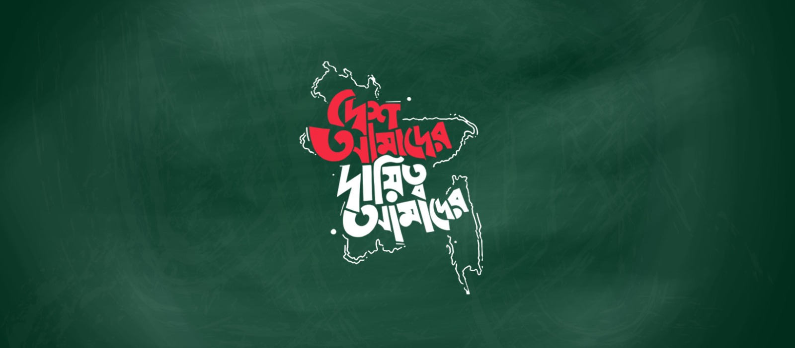

# বাংলাদেশ ২.০ এর উদ্যোগসমূহ

অজস্র রক্ত, ঘামের বিনিময়ে এক নির্মম স্বৈরাচারের হাত থেকে আমরা মুক্তি লাভ করেছি ৩৬শে জুলাই (৫ই আগস্ট) ২০২৪। এর সাথে জড়িত অনেক ইতিহাস, অনেক গল্প, অনেক অশ্রু! 
তবে এই সব কিছু পাড়ি দিয়ে এখন আমরা স্বপ্ন দেখি নতুন এক শোষণহীন, বৈষম্যহীন, সুখী, সমৃদ্ধ বাংলাদেশ গড়ার! 
এমন এক বাংলাদেশ যেখানে আমাদের পরবর্তী প্রজন্ম গর্বভরে আমাদের নাম স্মরণ করবে তাদের জন্য একটি সুন্দর ভবিষ্যৎ গড়ার কাণ্ডারি হিসেবে! 
এই নতুন বাংলাদেশের জন্য ইতোমধ্যেই বিভিন্ন রকম উদ্যোগ শুরু হয়ে গেছে, সামনে আরও অনেক কিছু হবে ইনশা'আল্লাহ! 
এই সব উদ্যোগকে এক জায়গায় করার ছোট্ট প্রয়াস এটি। 
আপনার যদি এই রকম কোনো উদ্যোগের কথা জানা থাকে, নিঃসঙ্কোচে এই রিপোজিটরিতে PR দিয়ে সেটি যুক্ত করতে পারেন। এছাড়াও যে কোনো ধরনের পরিবর্তন, পরিবর্ধনের জন্য পরামর্শ সানন্দে গ্রহণ করা হবে!

চলুন সবাই মিলে গড়ি নতুন এক বাংলাদেশ!

### স্বৈরাচারের নির্যাতন এবং অপরাধের ডকুমেন্টেশন

- [আন্দোলনে শহীদদের তালিকা](https://shohid.info)
- [আমরা বিচার চাই!](https://www.amrabicharchai.com)
- [চিনে রাখুন](https://chinerakhun.com)
- [ReformBangla](https://reformbangla.com)
- [Bangladesh Regime (2014-2024) Human Rights Archive](https://docs.google.com/document/d/12Hx5GUvI9xpKhn6-m3Slxokqrw1MS4Fb-3Zf9Hd7p8A)

### সামাজিক সমস্যা সমাধানের ডিজিটাল প্ল্যাটফর্মসমূহ

- [অভিযোগ](https://www.ovijog.net)
- [প্রতিরোধ : রিয়েল-টাইম কমিউনিটি সুরক্ষা প্ল্যাটফর্ম](https://protirodh.net)
- [টহল : নিরাপত্তা প্রহরী আপনার ফোনে](https://www.toholapp.com)
- [জনগণের দাবি](https://jonogon.org)
- [Expats who want to help rebuild Bangladesh](reversebraindrainbd.com)
